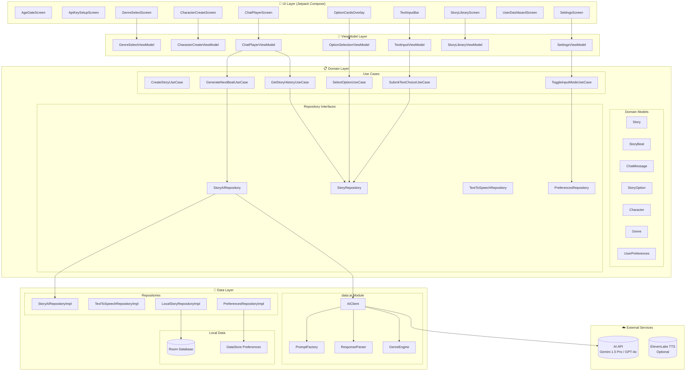
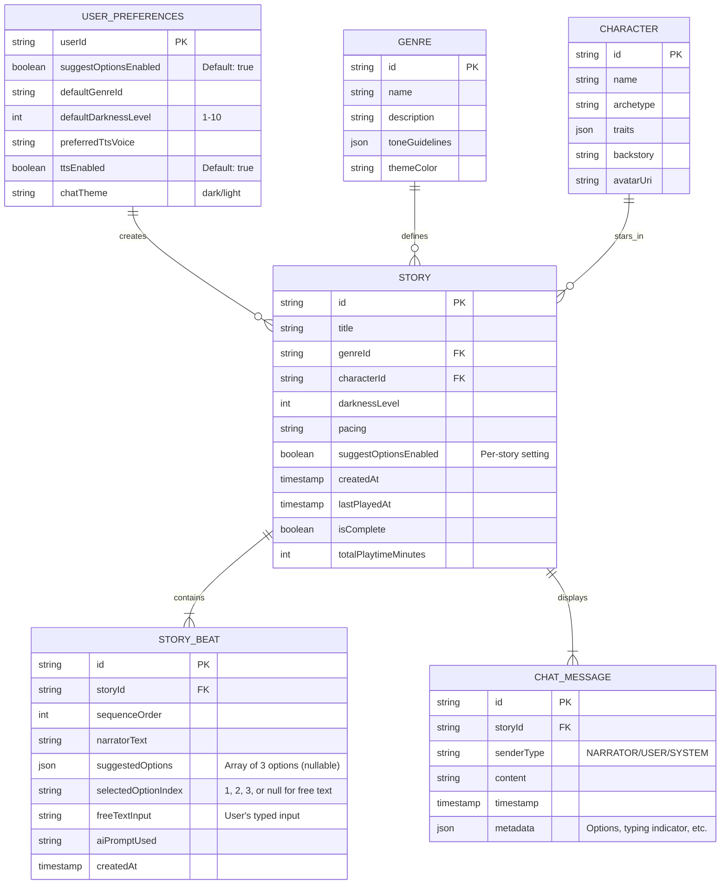
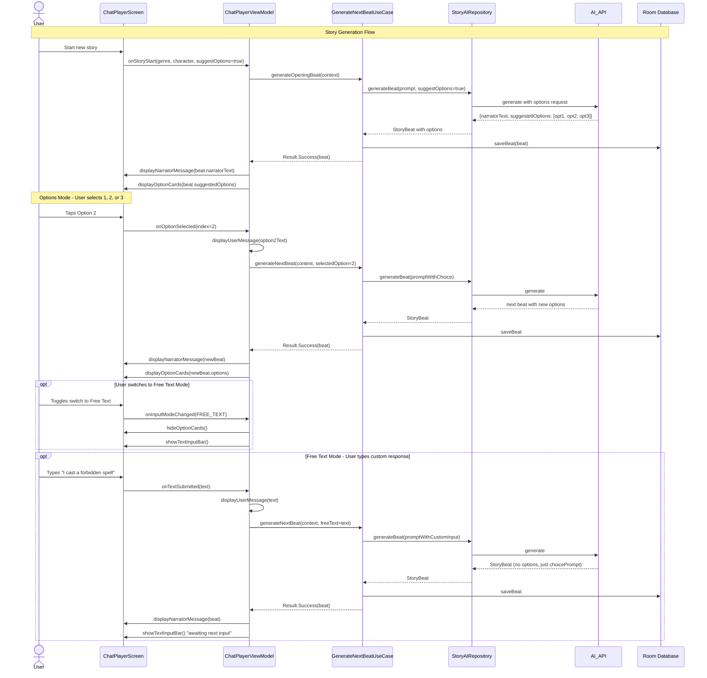
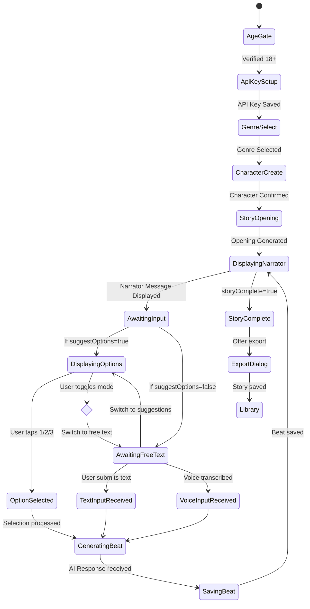

# ARCHITECTURE.md — Interactive Story Builder (18+ Multi-Genre Chat Edition)

An AI-powered Android app that creates immersive, choose-your-own-adventure stories across all genres through an interactive chat interface. Stories progress to decision points where users either select from 3 AI-suggested options (1/2/3) or enter free text based on their preference.

**Target Audience:** Private use, 18+ only  
**Content Policy:** No artificial content restrictions – the AI generates whatever the story demands.

---

## Section 1 — Product Contract

### 1.1 Product Definition

**Interactive Story Builder** is an AI-powered Android application that delivers immersive, choose-your-own-adventure experiences across unlimited genres through a modern chat interface. The narrative unfolds in a conversational format where the AI presents story beats and users respond either by tapping one of three suggested options or typing their own creative input.

The app combines the immersion of visual novels with the freedom of AI-generated storytelling – no content restrictions, maximum creative freedom.

---

### 1.2 Core Features

#### 1.2.1 Chat-Based Story Interface
- **Description:** Stories unfold in a chat-like interface with distinct message bubbles
- **Message Types:**
  - **Narrator Messages:** AI-generated story text with atmospheric formatting
  - **System Messages:** Chapter headers, scene transitions, dramatic reveals
  - **User Messages:** Display of selected option or typed input
- **Visual Design:** Genre-themed chat backgrounds, distinct bubble styles for narrator vs user
- **Scrollable History:** Full story transcript with timestamps

#### 1.2.2 Dual Input Modes

**Mode A: Suggested Options (Quick Play)**
- AI generates exactly 3 contextually appropriate options after each story beat
- User taps option 1, 2, or 3
- Options are meaningful: different approaches, moral choices, or creative solutions
- Visual: Card-based buttons with preview text

**Mode B: Free Text Input (Creative Mode)**
- User types any response they imagine
- No constraints on creativity, actions, dialogue, or direction
- Supports both typed input and voice-to-text
- AI adapts the narrative to any user input

**Mode Toggle:** Switch in settings (default: Suggested Options ON) + per-story override

#### 1.2.3 Multi-Genre Story Engine
- **Genre Selection:** User selects primary genre(s) at story creation:
  - **Horror:** Cosmic, psychological, body horror, folk horror, survival
  - **Fantasy:** High fantasy, urban fantasy, dark fantasy, sword & sorcery
  - **Sci-Fi:** Hard sci-fi, cyberpunk, space opera, post-apocalyptic
  - **Thriller:** Crime, noir, spy, legal, medical
  - **Adventure:** Exploration, survival, pulp action
  - **Romance:** Contemporary, historical, paranormal, erotica
  - **Mixed/Custom:** Combine multiple genres or define custom tone
- **Tone Controls:** Darkness level (1-10), pacing (slow burn to frantic), narrative complexity

#### 1.2.4 Persistent Story Library
- **Auto-save:** Every story beat saved immediately
- **Resume:** Jump back into any story at the last decision point
- **Export:** Download complete stories as formatted text or Markdown
- **Branch Exploration:** (Future) Revisit decision points and explore alternate paths

#### 1.2.5 Character & World Builder
- **Character Creation:** Name, archetype, personality traits, backstory, chat avatar
- **World Settings:** Time period, location, technology level, magic system rules
- **Character Consistency:** Traits remain consistent across all story branches

#### 1.2.6 User Dashboard & Settings
- **Statistics:** Stories created, total playtime, favorite genres, choices made
- **Settings:**
  - Default input mode (Suggested Options / Free Text)
  - AI creativity level (temperature)
  - TTS voice preferences
  - Chat theme (dark/light, genre-specific backgrounds)

---

### 1.3 Technical Specifications

| Component | Specification |
|-----------|-------------|
| **Platform** | Android, Kotlin 1.9+, Jetpack Compose |
| **Min SDK** | 26 (Android 8.0) |
| **AI Backend** | Gemini 1.5 Pro or GPT-4o (user-provided API key) |
| **Local DB** | Room (SQLite), offline-first |
| **Auth** | Anonymous local-only (Firebase optional for sync) |

---

**Contract locked.**

---

## Section 2 — System Architecture

### 2.1 — Component Diagram



---

### 2.2 — Module Map

| Module | Responsibility | Key Classes | Depends on |
|--------|---------------|-------------|------------|
| `:app` | Entry point, navigation, DI | `MainActivity`, `AppNavGraph`, `AppModule` | all feature modules |
| `:feature:chat-player` | Chat interface, message display, input handling | `ChatPlayerScreen`, `ChatPlayerViewModel`, `MessageList`, `ChatBubble` | `:domain`, `:data:ai`, `:data:tts` |
| `:feature:option-selection` | 3-option card display and selection | `OptionCards`, `OptionSelectionViewModel`, `OptionCard` | `:domain` |
| `:feature:text-input` | Free text input bar, voice input | `TextInputBar`, `TextInputViewModel`, `VoiceInputButton` | `:domain`, `:data:stt` |
| `:feature:genre-select` | Genre selection, tone settings | `GenreSelectScreen`, `ToneSlider`, `GenreCard` | `:domain` |
| `:feature:character-create` | Character customization | `CharacterCreateScreen`, `TraitSelector` | `:domain` |
| `:feature:story-library` | Saved stories management | `StoryLibraryScreen`, `ExportDialog` | `:domain` |
| `:feature:user-dashboard` | Stats and settings | `UserDashboardScreen`, `SettingsScreen` | `:domain` |
| `:domain` | Use cases, models, interfaces | `ChatMessage`, `StoryOption`, `SelectOptionUseCase` | `:core:common` |
| `:data:ai` | AI client and prompt factory | `AIClient`, `PromptFactory`, `ResponseParser` | `:domain` |
| `:data:tts` | Text-to-speech | `TtsManager`, `VoiceSelector` | `:domain` |
| `:data:stt` | Speech-to-text | `SpeechRecognizerWrapper` | `:domain` |
| `:data:local` | Room DB, DataStore | `AppDatabase`, `StoryDao`, `DataStoreManager` | `:domain` |
| `:core:ui` | Design system | `ChatTheme`, `MessageBubbleStyles` | — |
| `:core:common` | Utilities | `Result`, `FlowExtensions` | — |

---

### 2.3 — Data Model (Mermaid ER Diagram)



---

### 2.4 — Chat Flow: Options Mode vs Free Text Mode (Mermaid Sequence Diagram)



---

### 2.5 — Story State Machine (Mermaid stateDiagram)



---

## Section 3 — AI Prompt Design

### 3.1 — Story Beat Generation (Options Mode)

**System prompt:**
```
You are a skilled {genreName} storyteller creating an interactive narrative.
Protagonist: {characterName}, {characterDescription}
Tone: {darknessLevel}/10 darkness, {pacing} pacing

Generate immersive story content with meaningful choices.
Always provide exactly 3 distinct options for the player to choose from.
Options should represent different approaches: careful vs bold, moral vs pragmatic, etc.

Rules:
- Write narrator text in 3-5 atmospheric sentences
- Each option should be 5-10 words, action-oriented
- Options must genuinely branch the narrative in different directions
- Maintain established tone and character voice
- Respond in valid JSON only
```

**User prompt template:**
```
Story context (last 3 beats):
{recentContext}

Previous choice: "{lastChoice}"

Continue the story. Present exactly 3 options for what happens next.
```

**Output schema (Options Mode):**
```json
{
  "$schema": "http://json-schema.org/draft-07/schema#",
  "type": "object",
  "properties": {
    "narratorText": {
      "type": "string",
      "description": "Story narration, 3-5 sentences",
      "maxLength": 600
    },
    "suggestedOptions": {
      "type": "array",
      "minItems": 3,
      "maxItems": 3,
      "items": {
        "type": "string",
        "description": "Option text, 5-10 words, action-oriented",
        "maxLength": 100
      }
    },
    "storyComplete": {
      "type": "boolean"
    }
  },
  "required": ["narratorText", "suggestedOptions", "storyComplete"]
}
```

---

### 3.2 — Story Beat Generation (Free Text Mode)

**System prompt:**
```
You are a skilled {genreName} storyteller creating an interactive narrative.
Protagonist: {characterName}, {characterDescription}
Tone: {darknessLevel}/10 darkness, {pacing} pacing

The player will type their own actions and dialogue.
Adapt to ANY input creatively - there are no wrong answers.
If the input is unexpected, find an interesting way to incorporate it.

Rules:
- Write narrator text in 4-6 atmospheric sentences
- End with an open question or prompt for the player's next action
- Maintain narrative consistency while being flexible
- Respond in valid JSON only
```

**User prompt template:**
```
Story context (last 3 beats):
{recentContext}

The player just did/said: "{playerInput}"

Describe what happens next. Ask what they want to do now.
```

**Output schema (Free Text Mode):**
```json
{
  "$schema": "http://json-schema.org/draft-07/schema#",
  "type": "object",
  "properties": {
    "narratorText": {
      "type": "string",
      "description": "Story narration, 4-6 sentences",
      "maxLength": 800
    },
    "choicePrompt": {
      "type": "string",
      "description": "Open-ended prompt for player's next action",
      "maxLength": 150
    },
    "storyComplete": {
      "type": "boolean"
    }
  },
  "required": ["narratorText", "choicePrompt", "storyComplete"]
}
```

---

### 3.3 — Mode-Specific UI Behavior

| Feature | Options Mode | Free Text Mode |
|---------|--------------|----------------|
| **Input Method** | Tap 1/2/3 cards | Type text or use voice |
| **AI Response** | Always includes 3 options | Open-ended prompt |
| **UI Elements** | Option cards overlay, no keyboard | Text input bar, mic button |
| **Quick Actions** | Double-tap option to select | Send button, Enter key |
| **Visual Feedback** | Selected card highlights | User message appears in chat |
| **Switching** | Toggle in settings or per-story | Seamless mid-story switch |

---

## Section 4 — 5-Phase Implementation Plan

---

### Phase 1 — Project Scaffold & Chat UI Foundation
**Goal:** Repo compiles, chat interface skeleton works, message bubbles render.  
**Input:** Empty repo.  
**Output:** Multi-module project with `:feature:chat-player`, basic chat UI, scrolling message list.  
**Complexity:** Medium

**Subtasks:**
- [ ] 1.1 — Create all Gradle modules including `:feature:chat-player`, `:feature:option-selection`, `:feature:text-input`
- [ ] 1.2 — Define domain models: `ChatMessage`, `StoryBeat`, `StoryOption`, `UserPreferences`
- [ ] 1.3 — Implement Room entities and DAOs for `ChatMessage`, `StoryBeat`
- [ ] 1.4 — Create `ChatPlayerScreen` with `LazyColumn` for messages, basic `ChatBubble` composables
- [ ] 1.5 — Implement message types: `NarratorBubble`, `UserBubble`, `SystemMessage`
- [ ] 1.6 — Add scroll-to-bottom behavior, message timestamps
- [ ] 1.7 — Set up Hilt DI, verify app launches to empty chat screen
- [ ] 1.8 — Unit test: insert 10 `ChatMessage` entities, verify retrieval order

**Verification:**
- [ ] `./gradlew build` passes
- [ ] Chat screen displays test messages correctly
- [ ] Messages scroll smoothly, maintain order

---

### Phase 2 — AI Integration: Options Mode
**Goal:** AI generates story beats with 3 options, options display as cards.  
**Input:** Phase 1 complete.  
**Output:** Working Options Mode - tap 1/2/3 generates next beat.  
**Complexity:** Large

**Subtasks:**
- [ ] 2.1 — Implement `ApiKeySetupScreen` with secure storage
- [ ] 2.2 — Implement `PromptFactory` with two modes: `buildOptionsModePrompt()` and `buildFreeTextModePrompt()`
- [ ] 2.3 — Implement `StoryAIRepository.generateBeatWithOptions()` returning `StoryBeat` with `suggestedOptions`
- [ ] 2.4 — Implement `OptionCards` composable: 3 clickable cards with option text
- [ ] 2.5 — Implement `SelectOptionUseCase`: takes option index (1/2/3), saves to beat, triggers next generation
- [ ] 2.6 — Wire up: `ChatPlayerViewModel` → Option selection → AI generation → new beat displayed
- [ ] 2.7 — Add visual feedback: selected option animates, appears as user message in chat
- [ ] 2.8 — Write integration test: MockWebServer returns beat with 3 options, UI displays cards

**Verification:**
- [ ] AI returns valid JSON with 3 options
- [ ] Option cards display correctly with tap targets
- [ ] Selecting option generates next beat within 3 seconds
- [ ] Selected option appears as user message in chat history

---

### Phase 3 — Free Text Input Mode
**Goal:** Users can type custom responses, AI adapts to any input.  
**Input:** Phase 2 complete.  
**Output:** Working Free Text Mode with seamless mode switching.  
**Complexity:** Medium

**Subtasks:**
- [ ] 3.1 — Implement `TextInputBar` composable: text field, send button, character counter
- [ ] 3.2 — Implement `SubmitTextChoiceUseCase`: takes free text, saves to beat, triggers generation
- [ ] 3.3 — Implement `StoryAIRepository.generateBeatFromText()` for free text mode
- [ ] 3.4 — Add `InputModeToggle` switch in chat UI (Options ↔ Free Text)
- [ ] 3.5 — Implement mode state persistence: per-story preference saved to `UserPreferences`
- [ ] 3.6 — Add keyboard handling: auto-show/hide, imePadding, send on Enter
- [ ] 3.7 — Implement voice input integration: mic button → STT → text field → submit
- [ ] 3.8 — Manual test: Switch modes mid-story, verify narrative continuity

**Verification:**
- [ ] Text input accepts any text up to 500 chars
- [ ] Submitting text triggers AI generation
- [ ] Mode switch updates UI immediately (cards ↔ input bar)
- [ ] Free text input appears as user message in chat

---

### Phase 4 — Genre Selection, Character Creator & Story Management
**Goal:** Complete story creation flow, library, export functionality.  
**Input:** Phases 1-3 complete.  
**Output:** End-to-end flow: Genre → Character → Chat → Export.  
**Complexity:** Large

**Subtasks:**
- [ ] 4.1 — Implement `GenreSelectScreen`: genre grid with icons, darkness slider (1-10), pacing selector
- [ ] 4.2 — Implement `CharacterCreateScreen`: name, archetype dropdown, trait chips, backstory field
- [ ] 4.3 — Implement `GenreEngine`: JSON file with genre-specific prompt guidelines
- [ ] 4.4 — Implement story opening generation: first beat created from genre + character
- [ ] 4.5 — Implement `StoryLibraryScreen`: list with genre badges, last played, delete action
- [ ] 4.6 — Implement `ExportStoryUseCase`: exports full chat history as formatted Markdown
- [ ] 4.7 — Implement story resume: jump to last `StoryBeat`, restore chat history
- [ ] 4.8 — Manual test: Create horror story → 5 beats → export → verify Markdown format

**Verification:**
- [ ] Genre selection affects AI prompt (test with 2 different genres)
- [ ] Character details appear in AI-generated text
- [ ] Export creates readable Markdown with all messages
- [ ] Resume restores exact chat state

---

### Phase 5 — Polish, Settings & TTS
**Goal:** Production-ready app with TTS, themes, settings, error handling.  
**Input:** Phase 4 complete.  
**Output:** Complete app with all features polished.  
**Complexity:** Medium

**Subtasks:**
- [ ] 5.1 — Implement TTS: narrator messages spoken aloud, voice selector in settings
- [ ] 5.2 — Implement `SettingsScreen`: default input mode, API key management, TTS toggle, theme selection
- [ ] 5.3 — Add genre-specific chat themes: colors, background patterns per genre
- [ ] 5.4 — Implement error states: API error (retry), no connection (queue), invalid API key
- [ ] 5.5 — Add loading states: typing indicator while AI generates, skeleton cards
- [ ] 5.6 — Implement auto-save: every beat saved immediately, crash recovery
- [ ] 5.7 — Add haptic feedback on option selection, send button
- [ ] 5.8 — Full regression: Age gate → Setup → Genre → Character → Options mode → Switch to text → Export

**Verification:**
- [ ] TTS reads narrator messages with correct voice
- [ ] Settings persist across app restarts
- [ ] All error states show appropriate UI with recovery actions
- [ ] Full flow completes without crashes

---

## Section 5 — Open Questions

| # | Question | Recommended default | Blocks phase |
|---|----------|---------------------|--------------|
| 1 | **AI provider priority?** | Gemini 1.5 Pro primary, OpenAI fallback option in settings | Phase 2 |
| 2 | **Option text length limit?** | 10 words max, truncate with ellipsis if exceeded | Phase 2 |
| 3 | **Quick reply vs thoughtful mode?** | Single mode for MVP; add "think deeper" toggle in v2 | — |
| 4 | **Branch exploration (time travel)?** | Deferred to v2; save `branchOptions` in DB for future | Phase 4 |
| 5 | **Multiplayer/co-op stories?** | Not in scope; strictly single-player | — |
| 6 | **Story sharing/export formats?** | Markdown and plain text for v1; PDF/epub in v2 | Phase 4 |
| 7 | **Message history limit?** | Unlimited; auto-archive stories with 1000+ beats | — |
| 8 | **Voice input in Options mode?** | Yes: voice transcribes to text, user can edit before selecting | Phase 3 |

---

## Appendix — UI Mockup Description

### Chat Player Screen Layout
```
┌─────────────────────────────┐
│  [←] Story Title      [⚙️]  │  // Top bar with genre icon
├─────────────────────────────┤
│                             │
│  [🌙 Chapter 1]             │  // System message
│                             │
│  ┌─────────────────────┐   │
│  │ The ancient door    │   │  // Narrator bubble (left)
│  │ creaks open...      │   │
│  └─────────────────────┘   │
│                             │
│       ┌───────────────┐    │
│       │ I enter cautiously│ // User bubble (right)
│       └───────────────┘    │
│                             │
│  ┌─────────────────────┐   │
│  │ A cold wind...      │   │  // Latest narrator message
│  └─────────────────────┘   │
│                             │
├─────────────────────────────┤
│  [Options ▼]                │  // Mode toggle switch
├─────────────────────────────┤
│  ┌─────────────────────┐   │
│  │ 1. Search for traps │   │  // Option card 1
│  └─────────────────────┘   │
│  ┌─────────────────────┐   │
│  │ 2. Enter boldly     │   │  // Option card 2
│  └─────────────────────┘   │
│  ┌─────────────────────┐   │
│  │ 3. Listen first     │   │  // Option card 3
│  └─────────────────────┘   │
│                             │
│         - OR -              │
│                             │
│  ┌────────────────────┐[🎙️]│  // Free text mode
│  │ Type your action... │[➤]│  // Input + mic + send
│  └────────────────────┘    │
└─────────────────────────────┘
```

---

*Document version: 3.0*  
*Last updated: 2024-01-15*  
*Status: Architecture locked for Chat Interface Edition*
