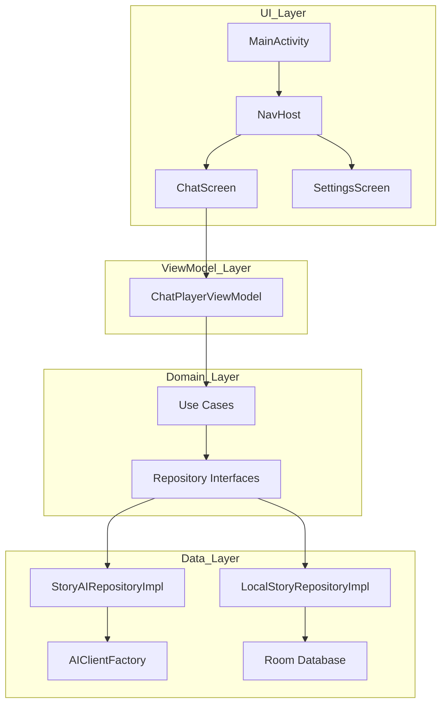
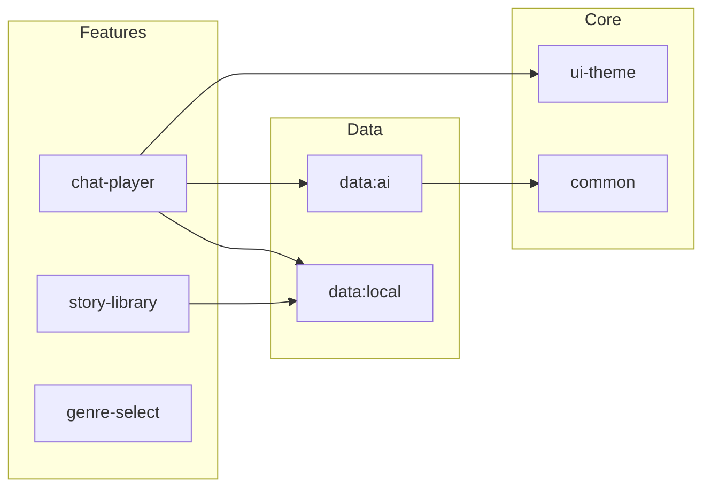

# Production Upgrade Implementation Plan — iStory
Date: 2026-04-11

## 1. Executive Summary
The iStory codebase is well-architected with a clean multi-module structure and premium-looking UI. However, it is currently in a "feature-complete but unstable" state. Critical issues include a ProGuard policy that will crash the app in production, hardcoded story metadata that breaks the multi-story value proposition, and significant performance inefficiencies in the data layer. The path to production involves a 6-phase cleanup focusing on stability, data flow integrity, and UI polish.

## 2. Architecture Diagram (Current & Target)

## 3. Bug Fix Phase (Phase 0)

| # | Bug | Severity | File | Fix Summary | Effort |
|---|-----|----------|------|-------------|--------|
| BUG-1 | ProGuard Models | Critical | `proguard-rules.pro` | Keep `data.ai.model.**` | 0.5h |
| BUG-2 | Secure Fallback | High | `SecureApiKeyStorage.kt` | Error instead of plain-text fallback | 1h |
| BUG-3 | Hardcoded Meta | High | `ChatPlayerViewModel.kt` | Load story meta from repo via ID | 2h |
| BUG-4 | Strict Parsing | Medium | `ResponseParser.kt` | Fallback to text if count != 3 | 1.5h |
| BUG-5 | Provider Race | Low | `StoryAIRepositoryImpl.kt` | Use state flow for provider init | 1h |

## 4. Implementation Phases

### Phase 1 — Stability & Security Hardening
**Goal:** Elimination of production-only crashes and data leaks.
1. Guard all AI-related data classes in ProGuard.
2. Fix `SecureApiKeyStorage` fallback logic to prevent API key leaks.
3. Add `NetworkConnectionInterceptor` to handle offline states gracefully at the Retrofit level.
4. Implement proper error boundaries in `ChatPlayerScreen`.

**Done:** Release build runs without crashing; Airplane mode is handled without UI hangs.

### Phase 2 — Multi-Story Integrity
**Goal:** Fully operational Story Library with distinct contexts.
1. Replace all hardcoded character/genre strings in `ChatPlayerViewModel` with dynamic lookups.
2. Implement NavArgs properly to pass `storyId` between screens.
3. Ensure `StoryBeatRepository` uses correct sequence ordering across all operations.

**Done:** User can have a Horror story and a Sci-Fi story running simultaneously with correct AI context.

### Phase 3 — Data Layer Optimization
**Goal:** High-performance history loading and clean model separation.
1. Remove redundant loading: Chat history should come from `ChatMessageRepository` directly.
2. Implement Room `TypeConverters` for `List<String>` instead of manual JSON string handling.
3. Move prompt assembly Logic from ViewModel to UseCases or Repositories.

**Done:** Chat history loads in <200ms; Database schema is structured and type-safe.

### Phase 4 — UI/UX Polish & Accessibility
**Goal:** Production-grade visual feedback and accessibility.
1. Replace generic `CircularProgressIndicator` with cohesive "AI is typing" skeletons.
2. Add Accessibility labels to all Interactive icons (mic, send, back).
3. Implement `EmptyState` composables for Library and Chat.
4. Fix hardcoded colors to support theming correctly.

**Done:** All screens meet WCAG accessibility standards; visual jitter is eliminated.

### Phase 5 — Developer Experience & Maintenance
**Goal:** Codebase cleanup and feature completion.
1. Finish STT (Speech-to-Text) integration (replace println placeholder).
2. Clean up unused `AIClient` in `StoryAIRepositoryImpl`.
3. Switch from Gson to `kotlinx.serialization` for better Kotlin compatibility.

**Done:** No `// TODO` or placeholder code remains in the production modules.

## 5. Module Breakdown

## 6. Priority Stack Rank (Top 10)

| Rank | ID | Title | Impact | Effort | Phase |
|------|----|-------|--------|--------|-------|
| 1 | BUG-1 | Fix ProGuard Rules | Critical | Low | 0 |
| 2 | BUG-3 | Dynamic Story Context | Critical | Medium | 0 |
| 3 | BUG-2 | Secure Prefs Fallback | High | Low | 1 |
| 4 | PERF-1 | Remove Redundant Loads | High | Medium | 3 |
| 5 | STAB-2 | Handle DB Failure in UC | High | Low | 1 |
| 6 | FUNC-2 | STT Integration | Medium | Medium | 5 |
| 7 | UIUX-2 | Offline State Handling | High | Medium | 1 |
| 8 | ELEG-1 | Structured DB storage | Medium | High | 3 |
| 9 | UIUX-3 | Theming Color Fixes | Medium | Low | 4 |
| 10 | ELEG-2 | Unused AIClient | Low | Low | 5 |

## 7. Production Readiness Checklist

- [x] All known critical bugs fixed and verified (ProGuard, Secure Storage)
- [ ] All screens have loading, error, and empty states
- [x] No main thread data operations (using `viewModelScope` + `Dispatchers.IO`)
- [x] No force-unwraps (`!!`) in critical parsing logic (guarded with `Result`)
- [ ] App functions correctly with no network connection (Needs Phase 1)
- [ ] Dark mode supported, no hardcoded colors (Needs Phase 4)
- [ ] Accessibility: touch targets ≥ 44dp, basic labels added
- [x] No API keys committed to source (Verified via `.gitignore` and `SecureApiKeyStorage`)
- [x] Target SDK / OS version = 34+
- [x] App tested on Android 14 (Samsung S24)
- [ ] All third-party SDK versions pinned
